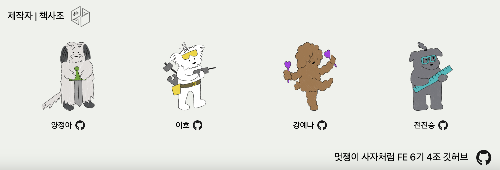
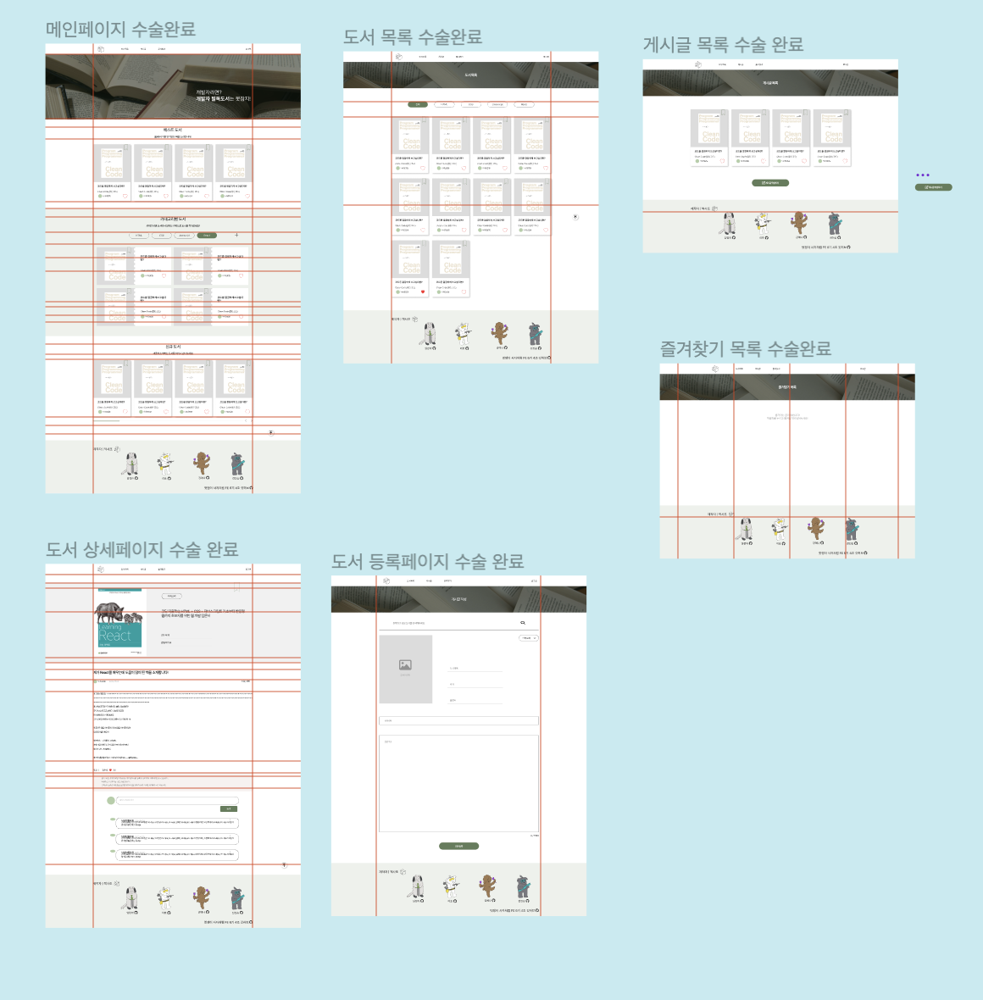

# 멋쟁이 사자처럼 FE6기 파이널 프로젝트 후기

FE6기 파이널 프로젝트는 총 16개의 조로 나뉘어져 프로젝트를 진행하게 되었다. 8월 31일 목요일부터 9월 24일까지, 3주하고도 조금 넘는 시간을 멋사측에서 정해준 팀원으로 활동하게 되었다. 사실 멋사에 들어온 것도 프로젝트를 경험해 보고 싶어서지만 막상 눈앞에 다가오니 걱정이 이만저만이 아니었다.

정말 다행히도 HTML부터 느꼇지만 나는 팀운이 좋은 것 같다. 팀원들 덕분에 중간에 피그마 시안부터 포기하고시 싶었는데 멱살잡고 캐리해줘서 얼마나 고마운지... 아직까지도 감사하게 생각한다.

무엇보다 프로젝트에 대해 의견을 나누는 부분에서, 나의 주장을 강하게 표현했음에도 불구하고 차분하게 대처해주고 좋은 말을 많이 해주셨다.

 

---

프로젝트 중반도 안되서 다른 조들의 안좋은 소식이 들려왔었다. 어떤조는 의견이 취합되지 않아 따로 혼자서 하신다는 분, 갑자기 연락끊고 잠수타는 분, 마지막으로 소통의 부재로 정말 많이 힘들었던 조도 있었다.

HTML과 JS프로젝트는 기간이 짧아서 트러블이 없었는지 몰라도 파이널에서는 많은 조가 트러블로 인해 고생하는 모습을 보면서 또 다시 팀원들에게 정말 고맙다는 말을 하고싶다.

---

# 프로젝트를 하면서 경험한 내용

리액트 파이널 프로젝트를 들어가기전, 리액트에 대해 벼락치기로 공부한만큼 이해하지 못한 내용이 많았다. context에 관한 내용이나, 왜 react-query를 써야하는지 등을 얼추 큰그림으로만 알고 있었다.

하지마니 이번 기회에 리액트 프로젝트를 진행하면서 왜 리액트가 상태에 의존하는지, 상태관리 라이브러리를 필요로 하는지 등을 깨달았고, 더 나아가 캐싱의 중요성과 그 모든게 유저의 사용자 경험을 형성사카는데 좋다는 생각까지 하게되면서 공부에 대한 욕심이 생겼다.

그리고 대망의 악명높다는 CORS에러는 마지막날 발표직전 새벽에 배포과정에서 나에게 큰 시련으로 다가왔다. CORS에러를 해결하기보단, pocketbase에서 제공하는 우회방법을 통하여 api를 구현시키는데 성공하였다. 이번 기회에 CORS에러가 무엇인지, 어떻게 대처해야 하는지 등에 대해서 블로그로 글을 남기려고 한다. 나같은 사람이 없길 바라며...😂
