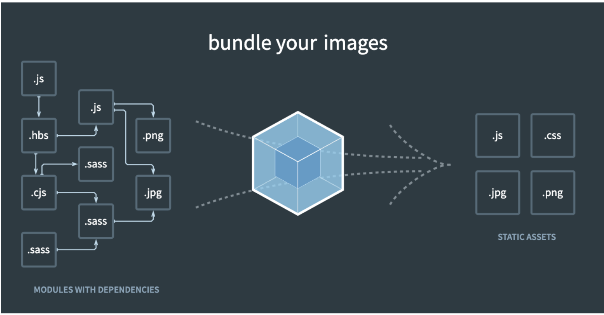

# 어떤 웹팩강의 들었어?

얼마전 인프런에서 '캡틴판교'님의 타입크립트 강의를 듣다가, 강의 리스트중에서 '프론트엔드 개발자를 위한 웹팩'이라는 강의를 접하게 되었다.
여태 웹팩이 대강 어떤일을 한다만 알고 있었기에 이번 기회에 웹팩에 대해서 좀 더 알고자 하는 마음에 강의를 수강하게 되었다.


현재 웹팩강의를 모두 수강완료한 상태이다. 그러면 이 강의를 수강한 이후 웹팩에 대해서 알게된 내용을 정리해보고자 한다.

## 웹팩이란?

먼저 웹팩이 어떤 일을 하는지부터 알아보자.

간단히 웹팩은 프론트엔드에서 가장 많이 사용되는 '모듈 번들러'라고 보면 된다. 여기서 모듈이라고 하면 보통 `import {} from ''`이라는 형식으로 가져오는 방식의 모듈이라 생각 할 수 있다. 하지만 웹팩에 관점에서 모듈은 좀 다르다.

웹팩에서는 HTML, CSS, JS, 이미지 등등 모~든 파일을 각각 모듈로 본다. 좀 더 말을 빌려와 적어보자면,

'웹팩에서 지칭하는 모듈이라는 개념은 위와 같이 자바스크립트 모듈에만 국한되지 않고 웹 애플리케이션을 구성하는 모든 자원을 의미합니다. 웹 애플리케이션을 제작하려면 HTML, CSS, Javascript, Images, Font 등 많은 파일들이 필요하죠. 이 파일 하나하나가 모두 모듈입니다.'

라고 한다.

이제 '번들링'이라는 말을 살펴보자면, 번들링은 빌드하다. 또는 변환하다 라는 단어로도 해석할 수 있다. `npm run build`라는 명령어를 본적이 있을 것이다. 즉, 빌드한다는 것은 번들링을 하겠다는 말과 같다.



## 웹팩이 필요한 이유에 대해서

그래서 프론트엔드는 웹팩을 왜 필요로 하는걸까?

1. 파일 단위의 자바스크립트 모듈 관리의 필요성
2. 웹 개발 작업 자동화 도구 (Web Task Manager)
3. 웹 애플리케이션의 빠른 로딩 속도와 높은 성능

크게 3가지 이유로 볼 수 있다.

이 중에서 가장 인상깊게 봤던 부분은, '웹 애플리케이션의 빠른 로딩 속도와 높은 성능'에 관련된 부분이다.

<a link='https://www.youtube.com/watch?v=WQue1AN93YU'>

이 영상을 보면 웹팩을 적용전과 후에 실제 속도를 비교해보는 영상이 나오는데, 실제 웹팩을 적용했을 때 말도안되게 빠르다는 것을 알 수 있었다.

## 강의에서 배운 부분

이 강이에선 웹팩이 어떤 방식으로 이미지를 압축해주고, 코드를 변환해주는지 등의 관한 내용은 알려주지 않는다. 다만, 프론트엔드 개발자 입문자 입장에서 웹팩이란 무엇인지, 왜 필요한지에 대해서 설명해주고 더 나아가 웹팩을 사용하기 위해서 어떻게 환경을 구성하는지와, 만약 다른 프로젝트에 들어갔을때 웹팩 환경이 주어진다면 그 웹팩이 어떤 환경을 가진 설정인지 등을 알 수 있게끔 도와주는 강의였다.

솔직히 좀 더 전문적인 지식을 바랬지만, 내가 웹팩 쓰면 썻지 뭐 할건 아니니까 ㅎㅎ..
그래도 조금 아쉬운 부분이 있긴 했다.

아무튼 크게 웹팩의 config설정에 대해서 배웠다.

웹팩은 크게 4가지 속성으로 분류된다고 볼 수 있다.

1. entry
2. output
3. loader
4. plugin

으로 볼 수 있다.

### entry

entry는 웹팩에서 웹 자원을 변환하기 위해 필요한 최초 진입점이자 자바스크립트 파일 경로이다. 웹팩에서 모든 파일을 변환하는게 아니라, 먼저 진입할 최초 하나의 파일을 기준으로 하여서, 모듈들을 연결지어가며 웹팩 내부에서 스스로 해석하여 결과물을 도출해준다. 그때 최초 진입점에 대해서 개발자는 entry를 설정 할 수 있다.

### output

output은 일상생활에서도 심심치않게 종종 사용하는 단어이다. 해석하자면 output은 웹팩의 해석이 끝났을 때, 결과물이 나오는 파일 경로를 뜻한다.

### Loader

Loader라는 부분이 조금 햇갈릴 수도 있다.

```js
// webpack.config.js
module.exports = {
  module: {
    rules: [],
  },
};
```

이런 형태로 작성하는데, 웹팩이 웹 애플리케이션을 해석할 때 자바스크립트 파일이 아닌 웹 자원들을 변환할 수 있도록 도와주는 속성이다.

### Plugin

Loder는 웹팩이 엔트리에 진입해서 아웃풋까지 나오는 과정을 도와주는 속성이었다면, Plugin은 도출된 결과물의 형태를 바꾸는 역할이라 보면 된다.

```js
// webpack.config.js
var webpack = require("webpack");
var HtmlWebpackPlugin = require("html-webpack-plugin");

module.exports = {
  plugins: [new HtmlWebpackPlugin(), new webpack.ProgressPlugin()],
};
```

위와 같은 형태로 쓰여진다.

## 이 후 여담

사실 웹팩에 대해서 내가 추가적으로 무엇을 만져보고 설정한적이 없다. 그래서 추후 프로젝트를 하게 되었을 떄 더 많은 정보를 알고 있다면 도움이 될 거같은데 아쉬운 부분이 남는다.
