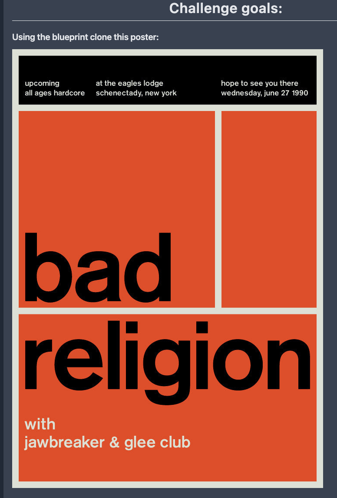
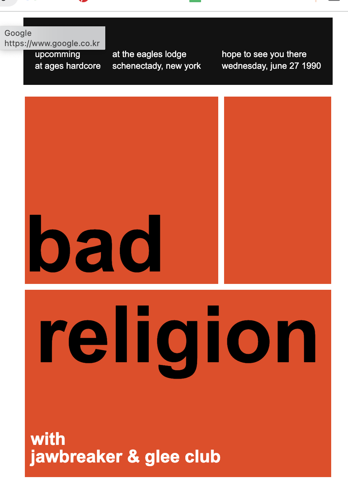

# 바빳던 3월 정보처리기능사 공부

일을 하면서 다른 무언가를 병행한다는 것은 정말 쉬운게 아닌거같다. 특히나 원래부터 준비하던 포폴사이트도 3월중순부터 중간에 잠시 쉬어가는 타임을 가졌다. 이유는 두가지,

1. Next로 옮겨서 작업 + 구조 변경을 위해서
2. 정보처리 기능사 4월초 시험준비를 위해서

정보처리기능사 시험을 등록하고 약 2~3주정도 남은 시간동안 코딩을 같이 병행하려 했으나.. 그것은 내 욕심이었던것. 쉽지않았다. 과감히 코딩을 잠시 쉬기로하고 정보처리기능사 자격시험에 집중해보기로했다.

## 이제 어느정도 정리가 되고난 후

정보처리기능사 시험을 합격하던 아니던 이제 4월초 시험이후 다시 코딩을 시작하기 위해서 vscode를 열고 키보드에 손을 올린순간... 어색하다. 이상하다. 영 머리가 돌아가지 않는 느낌이었다.

느슨해진 정신머리를 다시 바로잡기 위해서 어떻게해야하나 고민하던중 예전에 구매했던 노마드코더의 강의에서 CSS Chanllenge를 한다는 소식을 듣고는 '이거하면서 다시 감을 잡자' 라는 생각에 신청했다.

## CSS Challenge

지금까지 2번째 챌린지를 진행중이다.



위와 같은 사진을 똑같이 만드는 챌린지다.

음...



겉모습만 보기엔 비슷...? 하게 보일지도 모르지만 마음에 들지 않는다.

먼저 유지보수가 더럽게 힘들도록 막 만들었다.
만약 디자인이 조금 바뀐다면 대작업을 해야하는 쓰레기같은 코드... 같다.

후에 조금 더 보안해서 보기좋은 코드로 만들어봐야겠다.

```html
<main>
  <div class="container">
    <section class="section1">
      <span>bad</span>
    </section>
    <section class="section1"></section>
  </div>

  <section class="section2">
    <div>religion</div>
    <div>
      <span>with</span>
      <span>jawbreaker & glee club</span>
    </div>
  </section>
</main>
```

```css
.section2 {
  display: flex;
  flex-direction: column;
  align-items: center;
  position: relative;

  & div:first-child {
    font-size: 18vw;
    font-weight: 700;
  }

  & div:last-child {
    display: flex;
    flex-direction: column;
    position: absolute;
    left: 10px;
    bottom: 20px;

    & span {
      color: white;
      font-size: 30px;
      font-weight: 700;
    }
  }
}
```
