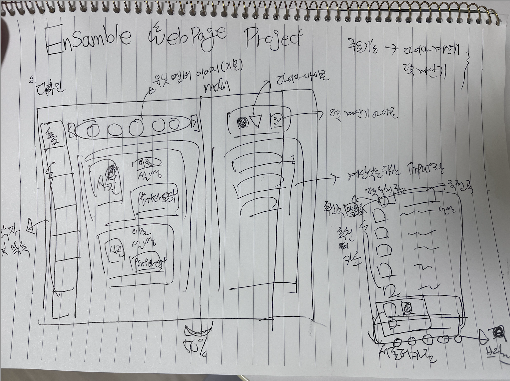

# Ensamble Project

## 어떤 프로젝트인가?

"앙상블 프로젝트"는 제가 즐겨하는 모바일 게임 '앙상블 스타즈!!'에서 시작되었습니다. 이 게임은 리듬게임으로, 다양한 카드의 조합을 통해 높은 점수를 얻고 새로운 카드를 획득하는 재미있는 시스템을 갖추고 있습니다.

이 게임을 즐기는 한국 유저로서, 다른 유저들 또한 게임을 더욱 즐겁게 즐기기 위해 공식 정보를 소개하고, '다이아 계산기' 및 '덱 효율 계산기'를 활용하여 게임의 재미를 한층 더 높일 수 있으면 좋겠습니다. 함께 게임을 즐기며 새로운 정보를 공유하고 소통하는 즐거움을 나누기를 기대합니다.

## 왜 이 프로젝트를 시작하게 되었는가?

한국에서는 이 일본 모바일 게임에 대한 정보를 얻기가 어렵습니다. 네이버 공식 카페를 제외하면 다른 큰 커뮤니티가 없어서 원하는 정보를 찾기 위해서는 상당한 시간과 노력이 필요합니다. 특히 최근에 추가된 신규 캐릭터의 공식 일러스트와 의상을 보고 싶을 때는 게임 내에서 얻지 않으면 확인하기 어려워서 네이버 카페에서 정보를 찾아야 합니다.

게임 내에서는 효율적인 덱을 제공하지만, 가끔은 그 내용이 틀릴 수도 있습니다. 또한 이벤트를 효율적으로 참여하고 적은 금액을 들여 다이아를 효율적으로 사용하기 위해서는 게임 내에 그런 기능이 부족합니다. 정보 수집과 자원 활용에 대한 스킬이 필요하며, 이러한 부분에서 게임 유저들은 네이버 공식 카페를 통해 서로 정보를 공유하고 도움을 얻고 있습니다.

네이버카페를 통하여 정보를 모아야하는 번거로움을 덜고, 유저들이 좀 더 편하게 게임을 즐기길 바라는 마음으로 이 프로젝트를 계획하게 되었습니다.

## 이 프로젝트의 주요 기능은?

우선, 이 프로젝트의 핵심 기능은 '다이아 계산기'와 '효율 덱 계산기'입니다. 사실, 이미 앙상블 스타즈의 숙련된 유저들이 이에 관한 모든 기능을 만들어 놓은 상황입니다. 그러나, 나는 이분들의 작품을 사용하면서 뭔가 부족함을 느꼈고, 그 감정이 누군가에게도 공유될 것으로 생각합니다.

또한, 현재 한 유저가 서비스중인 '효율 덱 계산기'는 엑셀 시트를 사용하므로 핸드폰에서는 조금 불편할 수 있다고 판단했습니다. 만약 홈페이지에서 로그인 기능을 제공하면서, 사용자가 보유한 덱을 개별적으로 확인할 수 있다면 엑셀 시트보다 사용자들에게 더 큰 편의를 제공할 수 있을 것으로 기대합니다.

https://www.dropbox.com/s/9iz8to1fbhp5vc3/%EC%95%99%EC%8A%A4%ED%83%80%20%EC%B6%94%EC%B2%9C%20%ED%8E%B8%EC%84%B1%20%EA%B3%84%EC%82%B0%EA%B8%B0%20v.1.6.xlsx?dl=0 (효율 덱 계산기 - 엑셀시트.ver)

## 프로젝트 시안

1. 왼쪽에는 공식정보를 제공
2. 오른쪽에는 '다이아 계산기' 또는 '효율 덱 계산기' 제공

## 이 프로젝트롤 무엇을 얻고 싶은가?

부트캠프를 통해 여러 사람들과 함께 프로젝트를 경험했지만, 혼자서의 프로젝트 경험은 아직 없습니다. 이전에 진행한 프로젝트들은 주로 실제 서비스를 목표로 하지 않아 부족한 부분이 많았습니다. 또한, 여러 명이 함께 참여한 프로젝트이기 때문에 사용된 기술에도 한계를 느꼈습니다.

이번 기회를 통해 실제 사용자들에게 배포해보고, 더 나아가 사용자들에게 실질적인 가치를 제공하는 개발자로서의 역량을 향상시키고 싶습니다.
